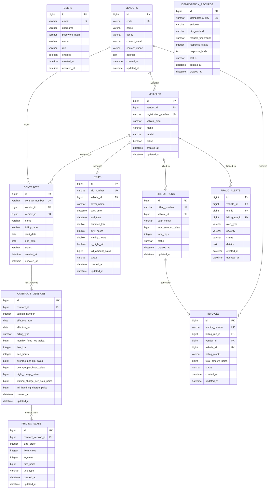

# FleetFlow — Relational Database Schema & Data Modeling

## 1. Relational Database Overview

FleetFlow utilizes **MySQL 8.0** as its primary relational store of truth. The database schema enforces data integrity through foreign key constraints, unique indexes, and audit timestamps (`created_at`, `updated_at`). All financial amounts are stored as 64-bit BigInt / Long integers representing values in **paisa** (1 INR = 100 Paisa) to avoid floating-point rounding inaccuracies.

---

## 2. Mermaid Entity-Relationship (ER) Diagram

---

## 3. Core Database Tables Specification

### 3.1 `users`
Stores user accounts for authentication and role-based security.
- **`id`** (`BIGINT`, PK, Auto-Increment)
- **`email`** (`VARCHAR(255)`, `UNIQUE`, `NOT NULL`)
- **`username`** (`VARCHAR(255)`, `NOT NULL`)
- **`password_hash`** (`VARCHAR(255)`, `NOT NULL`) — BCrypt hashed password
- **`role`** (`VARCHAR(50)`, `NOT NULL`) — `ADMIN`, `HR`, `EMPLOYEE`
- **`enabled`** (`BOOLEAN`, Default: `TRUE`)

### 3.2 `vendors`
Stores logistics transport companies providing fleet services.
- **`id`** (`BIGINT`, PK, Auto-Increment)
- **`code`** (`VARCHAR(50)`, `UNIQUE`, `NOT NULL`) — e.g. `VEN-DELHI-001`
- **`name`** (`VARCHAR(255)`, `NOT NULL`)
- **`tax_id`** (`VARCHAR(100)`) — GSTIN / Tax Identification Number

### 3.3 `vehicles`
Stores vehicle assets assigned to vendors.
- **`id`** (`BIGINT`, PK, Auto-Increment)
- **`vendor_id`** (`BIGINT`, FK ➔ `vendors.id`, `NOT NULL`)
- **`registration_number`** (`VARCHAR(50)`, `UNIQUE`, `NOT NULL`) — e.g. `DL01AB1234`
- **`vehicle_type`** (`VARCHAR(50)`, `NOT NULL`) — `CAB`, `SUV`, `VAN`, `BUS`
- **`active`** (`BOOLEAN`, Default: `TRUE`)

### 3.4 `contracts` & `contract_versions`
Stores master contracts and versioned rate structures.
- **`contracts.contract_number`** (`VARCHAR(100)`, `UNIQUE`, `NOT NULL`)
- **`contract_versions.effective_from`** (`DATE`, `NOT NULL`)
- **`contract_versions.effective_to`** (`DATE`)
- **`contract_versions.monthly_fixed_fee_paisa`** (`BIGINT`) — Retainer fee in paisa

### 3.5 `trips`
Stores completed vehicle trips and logs.
- **`distance_km`** (`DOUBLE`, `NOT NULL`)
- **`duty_hours`** (`DOUBLE`, `NOT NULL`)
- **`waiting_hours`** (`DOUBLE`, `NOT NULL`)
- **`toll_amount_paisa`** (`BIGINT`) — Pass-through toll charges in paisa

---

## 4. Referential Integrity & Constraints

1. **Unique Indexes**:
   - `users(email)`
   - `vendors(code)`
   - `vehicles(registration_number)`
   - `contracts(contract_number)`
   - `idempotency_records(idempotency_key)`
2. **On Delete Restrictions**:
   - `vendors` deletion is **blocked** if child `vehicles` exist.
   - `vehicles` deletion is **blocked** if active `contracts` or `trips` exist.
